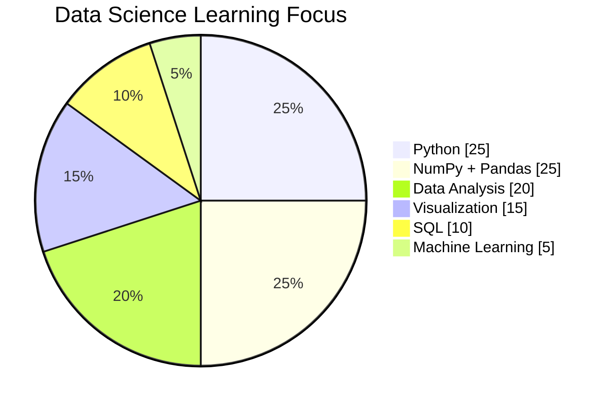

<div align="center">


# 👋 Hi, I'm Uzair Ghole

### 🎓 TY BSc IT Student | 📊 Aspiring Data Science Professional

[](https://github.com/uzairghole)
[](https://www.python.org/)
[](https://github.com/uzairghole)

</div>

---

## 👨‍💻 About Me

I am a **Third Year BSc IT student** at **Hirwal Education Trust**, building my skills toward a career in **Data Science**.

My current focus is on learning how to work with data using **Python, NumPy, Pandas, visualization tools, SQL and Machine Learning**. I enjoy learning through practical exercises, academic projects and hands-on experimentation.

> **Learning → Practicing → Building → Improving**

### 🎯 Career Direction

| Area | Current Focus |
|---|---|
| 🎓 Education | TY BSc IT |
| 📊 Career Goal | Data Science |
| 🐍 Programming | Python |
| 🔢 Data Libraries | NumPy, Pandas |
| 📈 Visualization | Matplotlib, Seaborn |
| 🗄️ Database | SQL |
| 🤖 Next Step | Machine Learning |
| 🧰 Tools | Git, GitHub, VS Code, Anaconda |

---

## 🛠️ Tech Stack

<div align="center">


</div>

### 📚 Learning Roadmap

```text
Python
  ↓
NumPy + Pandas
  ↓
Data Cleaning + EDA
  ↓
Matplotlib + Seaborn
  ↓
SQL + Databases
  ↓
Machine Learning
  ↓
Real-World Data Science Projects
```

---

## 📊 My Data Science Skill Focus



> The chart represents my **current learning focus**, not a formal skill rating.

---

## 📈 GitHub Statistics

<div align="center">


</div>

---

## 🔥 Contribution Activity

<div align="center">


<br><br>


</div>

---

## 📂 Featured Repositories

| Repository | Focus |
|---|---|
| 🐍 **Python-Data-Analysis-Practicals** | Python, Pandas, NumPy, Data Analysis & Visualization |
| 🔢 **NumPY** | NumPy learning and practical work |
| 🌐 **MERN-Stack-Practicals** | MERN Stack academic practicals |
| 👥 **Uzair-Farzan** | Collaborative learning/project work |

> My profile is gradually moving toward a **Data Science-focused portfolio**.

---

## 🧠 What I'm Learning

| Skill | Status |
|---|---|
| Python | 🟢 Learning & Practicing |
| NumPy | 🟢 Learning & Practicing |
| Pandas | 🟢 Learning & Practicing |
| Data Cleaning | 🟢 Practicing |
| EDA | 🟢 Practicing |
| Matplotlib / Seaborn | 🟡 Developing |
| SQL | 🟡 Developing |
| Machine Learning | 🔵 Next Stage |

---

## 📌 Current Goals

- Build strong **Python fundamentals**
- Become confident with **NumPy & Pandas**
- Perform real **Data Cleaning and EDA**
- Improve **SQL and database skills**
- Learn **Machine Learning**
- Build and document **Data Science projects**
- Maintain a clean and professional GitHub portfolio

---

## 📫 Contact

<div align="center">

📧 **gholeuzair73@gmail.com**

🌐 **GitHub:** [@uzairghole](https://github.com/uzairghole)

</div>

---

<div align="center">

### 🚀 Learning. Building. Growing.

**Python → Data Analysis → Machine Learning → Data Science**


</div>
